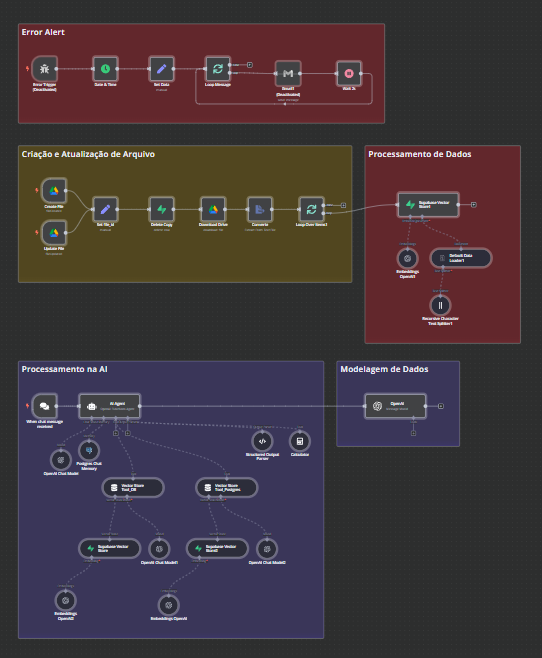

# 📄 RAG AI Processing with n8n and Supabase

## 🌟 Overview
This project is a document, text, and audio processing pipeline built with n8n and Supabase. It automates the extraction, classification, and storage of various data types, integrating AI for text embeddings and retrieval.



## ✨ Features
**Automated File Processing:** Monitors cloud storage for new or updated files.
**OCR & Text Extraction:** Converts scanned documents into structured text.
**AI Embeddings:** Uses OpenAI embeddings for semantic search.
**Vector Store:** Stores extracted information in Supabase for efficient retrieval.
**AI Chat Processing:** Implements an AI agent for user interactions.
**Error Handling & Logging:** Implements retry mechanisms and alerting for failures.

## 🛠 Technologies Used
**n8n:** Workflow automation.
**Supabase:** Database and vector storage.
**OpenAI:** AI embeddings and chat models.
**Google Drive API:** File monitoring and management.
**PostgreSQL:** Data storage and retrieval.

## 🔄 Workflow Breakdown
### 1️⃣ File Processing
Watches a Google Drive folder for new or updated files.
Extracts text using OCR (if applicable).
Stores metadata and text data in Supabase.

### 2️⃣ AI Processing
Generates embeddings using OpenAI.
Stores embeddings in Supabase’s vector store.
Enables similarity search using vector embeddings.

### 3️⃣ Chat AI Agent
Processes user queries using OpenAI GPT-4o.
Retrieves relevant document context from Supabase.
Supports structured responses and intelligent conversation handling.

### 4️⃣ Error Handling
Logs errors and retries failed tasks up to 3 times.
Sends email alerts for critical failures.

## 🚀 Installation & Setup
### Prerequisites
n8n instance (self-hosted or cloud)
Supabase account
OpenAI API key
Google Drive API credentials

### Setup Steps
1️⃣ Clone the repository:
   ```sh
   git clone https://github.com/KelvesMoura/Core-Document-Audio-Text-Processing.git
   ```
2️⃣ Import the n8n workflow JSON into your n8n instance.
3️⃣ Set up environment variables in Supabase for API keys and DB connections.
4️⃣ Configure Google Drive API access.
5️⃣ Run the n8n workflow.

## 🔮 Future Improvements
Implement advanced AI models for better document classification.
Optimize performance for large-scale document processing.
Improve security and access control in Supabase.

## 🙌 Acknowledgments
This project was developed as part of a technical assessment to explore the capabilities of n8n and Supabase for automated document processing and AI-powered retrieval.

